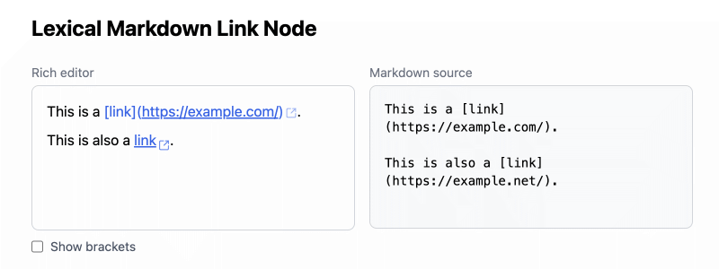

# etude-lexical-markdown-link

A personal study project implementing Markdown-style link (`[label](url)`) editing logic in [Lexical](https://lexical.dev/).

## About

This is an etude — a hands-on exercise for learning, not a production tool. Building anything non-trivial with Lexical turns out to be surprisingly involved, so this project exists as a record of that exploration.

The editor behavior is loosely inspired by Obsidian's editor, but is not identical to it. The logic was written independently from scratch.

## Features

The UI is a dual-panel layout: a rich editor on the left and a live Markdown source preview on the right.

### Link mode (default — cursor is outside the link)

- Raw markdown syntax is hidden; only the label is rendered as a blue underlined link with an external-link icon
- Clicking the link moves the cursor inside → switches to source mode

### Source mode (cursor is inside the link)

- The full `[label](url)` syntax is revealed and editable
- Clicking the URL portion opens it in a new tab
- Pressing **Escape** moves the cursor outside → returns to link mode

### Auto-conversion

- Typing `[label](url)` anywhere in the editor automatically wraps it into a link node
- Editing the syntax back into something that no longer matches (e.g., deleting a bracket) automatically unwraps it to plain text

### Show Brackets toggle

An optional display mode that renders faint `[` `]` around the label even in link mode, hinting at the underlying Markdown structure.

## Implementation Notes

- **Custom Lexical nodes** — `MarkdownLinkNode` (`ElementNode`) wraps `MarkdownLinkLabelNode` and `MarkdownLinkUrlNode`, both `TextNode` subclasses generated via a factory to avoid duplication.
- **`MarkdownLinkPlugin`** is composed of five focused hooks:
  - `useNodeTransforms` — regex-based detection; wraps matching text into link nodes and unwraps broken ones
  - `useSelectionFocusTracking` — adds/removes an `.is-focused` CSS class on the enclosing link node
  - `useTextInsertionBehavior` — redirects new text typed immediately after a link to the next sibling, protecting the link structure
  - `useEscapeKeyBehavior` — moves the cursor outside the link on Escape
  - `useClickHandling` — dual-mode click (enter link vs. open URL)
- **CSS-driven visual modes** — the entire link-mode / source-mode visual difference is handled in CSS via the `.is-focused` class; no JavaScript re-render is needed for the toggle.

## License

[MIT](LICENSE)
